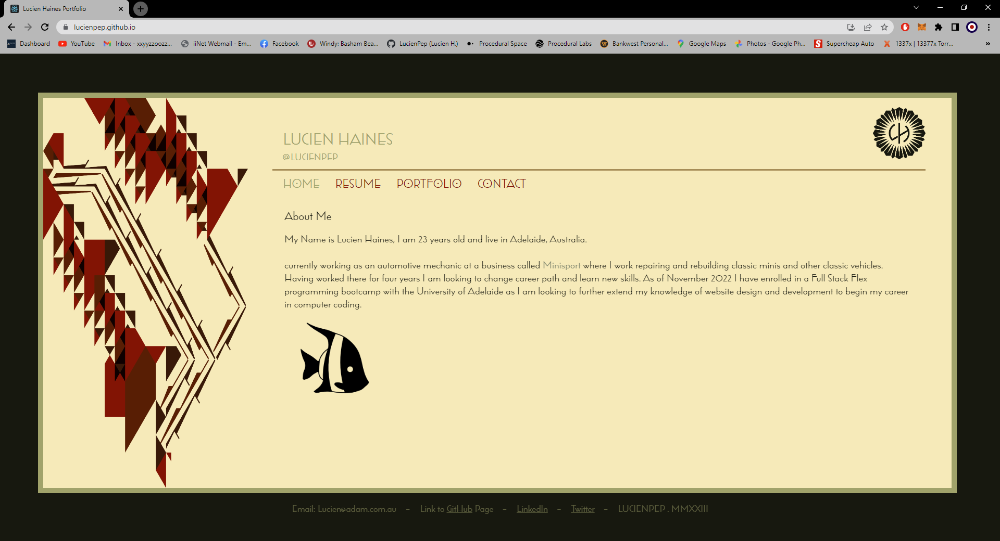

# Homework-Week-20
## Lucien Haines Portfolio

 My task was  to create a portfolio using your new React skills.

### User Story
```
AS AN employer looking for candidates with experience building single-page applications
I WANT to view a potential employee's deployed React portfolio of work samples
SO THAT I can assess whether they're a good candidate for an open position
```

### Table of Contents
1. [Acceptance Criteria](#acceptance-criteria)
2. [Work Description](#work-description)
3. [Deployed Site Link](#link-to-deployed-site)
4. [Screenshot](#screenshot)
5. [Installation](#installation)
6. [License](#license)
7. [Questions](#questions)

### Acceptance Criteria
```
GIVEN a single-page application portfolio for a web developer
WHEN I load the portfolio
THEN I am presented with a page containing a header, a section for content, and a footer
WHEN I view the header
THEN I am presented with the developer's name and navigation with titles corresponding to different sections of the portfolio
WHEN I view the navigation titles
THEN I am presented with the titles About Me, Portfolio, Contact, and Resume, and the title corresponding to the current section is highlighted
WHEN I click on a navigation title
THEN I am presented with the corresponding section below the navigation without the page reloading and that title is highlighted
WHEN I load the portfolio the first time
THEN the About Me title and section are selected by default
WHEN I am presented with the About Me section
THEN I see a recent photo or avatar of the developer and a short bio about them
WHEN I am presented with the Portfolio section
THEN I see titled images of six of the developer’s applications with links to both the deployed applications and the corresponding GitHub repositories
WHEN I am presented with the Contact section
THEN I see a contact form with fields for a name, an email address, and a message
WHEN I move my cursor out of one of the form fields without entering text
THEN I receive a notification that this field is required
WHEN I enter text into the email address field
THEN I receive a notification if I have entered an invalid email address
WHEN I am presented with the Resume section
THEN I see a link to a downloadable resume and a list of the developer’s proficiencies
WHEN I view the footer
THEN I am presented with text or icon links to the developer’s GitHub and LinkedIn profiles, and their profile on a third platform (Stack Overflow, Twitter)
```

---
[](https://opensource.org/licenses/MIT)

### Work Description
I Started by installing react and sketching out roughly what I wanted the webpage to look like. After deciding on a design I build the base page and added in the pictures and titles, next I added a basic a tag nav bar and looked into react routes. After practicing with react routes I implemented them into my webpage and started working on basic page layout. From there I wanted to add animations to teh pages and make the website visually appealing. I then started on the skills and resume page which later I combined as I felt there was little need for two individual pages. I then worked on the contact box section and found a useful add on called validator which allowed me to validate correct emails on my contact form. After that I added in the project tabs my six recent projects an image to go with them and associated links. Unfortunately due to time constraints I was not able to add full webpage sizing functionality but used media queries instead to make the webpage usable at smaller screen sizes, I plan to fix this in my own time later.

### Link To Deployed Site

## [Week-20-GitHub-Pages](https://lucienpep.github.io/React-Protfolio-Lucien-Haines/)

### Screenshot



### Installation

For this application no dependencies need to be installed as a user on the deployed application.

### License

The license I am using for my project is<br>[MIT](https://opensource.org/licenses/MIT)

### Questions

GitHub: [Lucienpep](https://github.com/Lucienpep)<br>

For any further questions contact me via:

Email: <xxyyzzoozz@gmail.com>

---
Lucien Haines UADL 2023